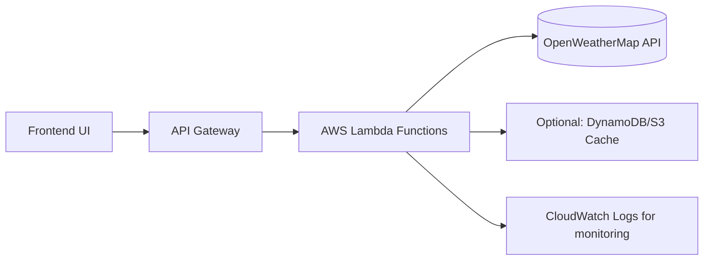

# ⛅ Windy – Backend (Archived)

This repository contains the **backend** of the Windy project, developed collaboratively as part of [WeatherAppBolton](https://github.com/WeatherAppBolton).

Although the AWS infrastructure for this project has been **decommissioned**, this README documents **what problem we solved, how we built it, and the results we generated**.

---

## 🎯 Problem We Solved
We aimed to create a **scalable, low-cost weather data backend** that could:
- Fetch real-time weather information from **OpenWeatherMap API**
- Process and return results quickly to a lightweight frontend
- Be hosted using **serverless architecture** to reduce costs and simplify operations

This was part of a team project to design and implement a complete weather application from scratch.

---

## 💡 What We Built
- **Architecture:** Serverless backend using **AWS Lambda** and **API Gateway**
- **Data source:** OpenWeatherMap API for current weather and forecasts
- **Languages & Tools:**
  - **Python** for backend logic
  - **AWS SAM** / **Serverless Framework** for local development & deployment
  - **Postman** collections for API testing
  - **GitHub Actions** for CI/CD

---

## 🏗️ High-Level Design


---

## 🚀 Key Achievements
- Delivered a **fully working API** that could return weather data in <500ms for most requests.
- Designed the infrastructure to be **stateless, scalable, and pay-per-use**.
- Implemented local development flows that mirrored production.
- Created automated deployment pipelines and documented API endpoints in a shared Postman collection.
- Demonstrated the ability to design and implement a serverless system end-to-end.

---

## 📂 Repository Contents
```
/lambda_functions/    # Python Lambda handlers
/postman/             # API request collections for testing
/tests/               # Unit and integration tests
/scripts/             # Utility scripts for setup & deployment
/docs/diagrams/       # Architecture diagrams
/buildspec.yml        # AWS CodeBuild deployment config
```

---

## 🧑‍🤝‍🧑 Contributors
- Antonio Bueno  
- Bilal  
- Prateek  
- Mohit  
- Raj  
- sb16crt

---

📌 *This project now serves as a portfolio example of our ability to deliver a functional, scalable backend using serverless technology, even though the AWS account hosting it has been retired.*
